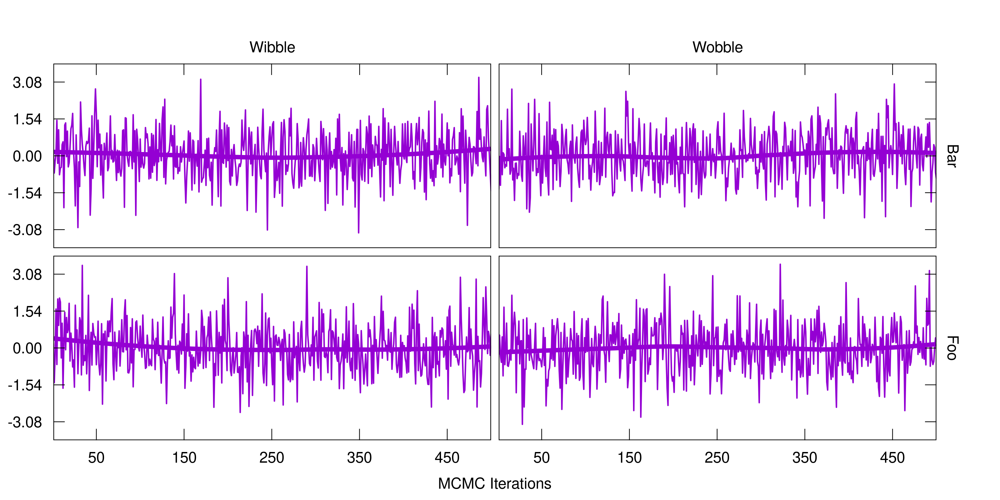

<!-- README.md is generated from README.Rmd. Please edit that file -->

# ggnuplot

<!-- badges: start -->

<!-- badges: end -->

ggnuplot provides a couple of tools to make your
[ggplots](https://ggplot2.tidyverse.org/) look like
[gnuplots](http://www.gnuplot.info/), which may be helpful if you use
both of them in one project.

## Installation

You can install the development version of ggnuplot from
[GitHub](https://github.com/) with:

``` r
# install.packages("devtools")
devtools::install_github("hriebl/ggnuplot")
```

## Example

ggnuplot features inward ticks, secondary axes, and labels on the plot
corners. It also comes with gnuplot’s default color palette. This is
what it looks like:

``` r
library(ggplot2)
library(ggnuplot)

ggplot(iris, aes(Sepal.Width, Sepal.Length, color = Species)) +
  geom_point() +
  scale_color_gnuplot() +
  scale_x_gnuplot() +
  scale_y_gnuplot() +
  theme_gnuplot()
```


And one example with facets:

``` r
set.seed(1337)

df <- data.frame(
  y = rnorm(2000),
  x = rep(1:500, times = 4),
  cat1 = rep(c("Foo", "Bar", "Foo", "Bar"), each = 500),
  cat2 = rep(c("Wibble", "Wobble"), each = 1000)
)

ggplot(df, aes(x, y)) +
  geom_line(color = gnucolors[1]) +
  geom_smooth(color = gnucolors[1], size = 1.5, se = FALSE) +
  facet_grid(vars(cat1), vars(cat2)) +
  xlab("MCMC Iterations") +
  ylab(NULL) +
  scale_x_gnuplot(index = 1:5, facet = TRUE, expand = c(0, 0)) +
  scale_y_gnuplot(index = 1:5, facet = TRUE, expand = c(0, 0)) +
  theme_gnuplot()
```



I wish my samplers worked that well\!
